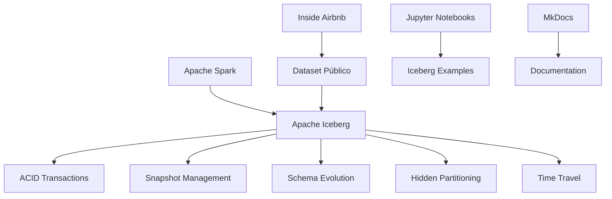

# Apache Spark com Apache Iceberg - Dataset Airbnb

Bem-vindo ao projeto acadêmico que demonstra as operações CRUD (Create, Read, Update, Delete) utilizando Apache Spark com Apache Iceberg, utilizando dados públicos do Inside Airbnb.

## Objetivo do Projeto

Este projeto tem como objetivo demonstrar as funcionalidades do Apache Iceberg utilizando dados reais:

- **Apache Iceberg**: Tabela aberta para analytics em data lakes com suporte a schema evolution e snapshot management
- **Dataset Airbnb**: Dados públicos do Inside Airbnb do Rio de Janeiro para demonstração prática

## Arquitetura do Projeto (Spark + Iceberg)



## Cenário de Negócio

O projeto demonstra operações CRUD com **Apache Iceberg** e **Delta Lake** utilizando dados reais do Airbnb:

### Dataset Airbnb (Dados Públicos)

Utiliza dados reais do [Inside Airbnb](http://insideairbnb.com/get-the-data/) do Rio de Janeiro:

- **Hosts**: Proprietários de imóveis
- **Listings**: Imóveis cadastrados na plataforma --utilizado para o projeto
- **Reviews**: Avaliações dos hóspedes (estrutura preparada)

### Fonte dos Dados

- **URL**: `http://data.insideairbnb.com/brazil/rj/rio-de-janeiro/2024-05-21/visualisations/listings.csv`
- **Cidade**: Rio de Janeiro, Brasil
- **Data**: 2024-05-21
- **Arquivo**: `listings.csv` (visualizações)

## Funcionalidades Demonstradas

### Spark + Apache Iceberg com Dataset Airbnb
- ✅ **CREATE**: Criação de tabelas Iceberg
- ✅ **INSERT**: Inserção de dados do dataset público
- ✅ **SELECT**: Consultas e análises dos dados
- ✅ **UPDATE**: Atualização de registros
- ✅ **DELETE**: Exclusão de dados
- ✅ **Snapshot Management**: Gerenciamento de versões e rollback
- ✅ **Schema Evolution**: Evolução de schema com compatibilidade
- ✅ **Hidden Partitioning**: Particionamento automático
- ✅ **ACID Transactions**: Transações atômicas e consistentes
- ✅ **Time Travel**: Navegação temporal nos dados

### Spark + Delta Lake com Dataset Airbnb
#TODO

## Estrutura do Projeto

```
spark-delta-iceberg/
├── docs/notebooks/                  # Jupyter notebooks servidos no MkDocs
│   └── spark-iceberg.ipynb          # Exemplos Apache Iceberg
├── docs/                            # Documentação
│   ├── airbnb-dataset/              # Documentação Dataset Airbnb
│   ├── iceberg/                     # Documentação Apache Iceberg
│   ├── delta/                   # Documentação Delta Lake
├── pyproject.toml                   # Dependências do projeto
└── mkdocs.yml                      # Configuração da documentação
```

## Tecnologias Utilizadas

- **Apache Spark 3.5.0**: Engine de processamento distribuído
- **Apache Iceberg**: Tabela aberta para analytics
- **Inside Airbnb**: Dataset público de dados reais
- **Python 3.12+**: Linguagem de programação
- **Jupyter Lab**: Ambiente de desenvolvimento
- **MkDocs**: Geração de documentação
- **UV**: Gerenciador de dependências Python

## Documentação

A documentação completa está organizada nas seguintes seções:

- **[Dataset Airbnb](airbnb-dataset/overview.md)**: Dados públicos do Inside Airbnb com operações CRUD
- **[Estrutura de Dados](airbnb-dataset/data_structure.md)**: Detalhes sobre as tabelas e relacionamentos
- **[Operações CRUD](airbnb-dataset/operations.md)**: Exemplos práticos
- **[Apache Iceberg](iceberg/overview.md)**: Operações e funcionalidades do Apache Iceberg
- **[Configuração](setup/installation.md)**: Instruções de instalação e configuração

## Autores

- **João Vitor Figueiredo Espindola**
- **Arthur Ghizi**
- **Jorge Loh**

**Próximos Passos**: Consulte a [documentação de instalação](setup/installation.md) para começar a usar o projeto.
